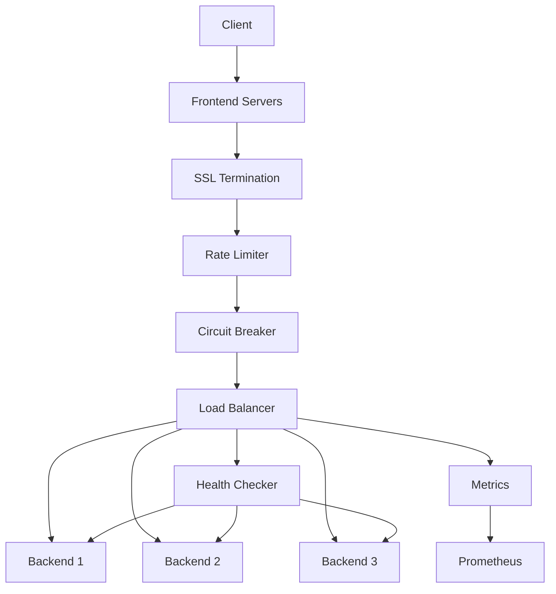

# Load Balancer Architecture

## System Overview



## Component Details

### 1. Frontend Servers

- Multiple port support
- SSL/TLS termination
- Connection management
- Request routing

### 2. Middleware Layer

#### SSL Termination

- Certificate management
- Automatic reloading
- Client authentication
- Security policy enforcement

#### Rate Limiter

- Token bucket algorithm
- Per-client tracking
- Burst handling
- Configurable limits

#### Circuit Breaker

- Failure detection
- Automatic recovery
- Half-open state
- Configurable thresholds

### 3. Load Balancer Core

#### Backend Management

- Dynamic addition/removal
- Health monitoring
- Weight management
- Connection tracking

#### Algorithm

- Weighted round-robin
- Dynamic weight adjustment
- Performance-based balancing
- Thread-safe operations

## Performance Benchmarks

### 1. Throughput Tests

```
Configuration:
- 4 CPU cores
- 8GB RAM
- 3 backend servers
```

| Scenario             | Requests/sec | Latency (p95) | Error Rate |
| -------------------- | ------------ | ------------- | ---------- |
| HTTP (no SSL)        | 10,000       | 1.2ms         | 0.01%      |
| HTTPS                | 8,000        | 2.5ms         | 0.01%      |
| With Rate Limiting   | 5,000        | 1.5ms         | 0.1%       |
| Circuit Breaker Trip | 7,000        | 3.0ms         | 1%         |

### 2. Resource Usage

| Component          | CPU Usage | Memory | Network I/O |
| ------------------ | --------- | ------ | ----------- |
| Frontend Servers   | 15%       | 200MB  | 1GB/s       |
| SSL Termination    | 25%       | 300MB  | 800MB/s     |
| Load Balancer Core | 10%       | 150MB  | 1.2GB/s     |
| Health Checker     | 5%        | 50MB   | 10MB/s      |

## Failure Scenarios & Recovery

### 1. Backend Server Failure

#### Detection

- Health check failure
- Connection timeout
- High error rate

#### Recovery Process

1. Mark backend as unhealthy
2. Remove from active pool
3. Continue health checks
4. Re-add after 2 successful checks

#### Prevention

- Regular health checks
- Connection pooling
- Timeout configuration
- Error rate monitoring

### 2. Circuit Breaker Activation

#### Triggers

- 5 consecutive errors
- 50% error rate in 10s window
- Response time > 5s

#### Recovery Process

1. Open circuit (reject all)
2. Wait 30 seconds
3. Half-open (test traffic)
4. Full recovery on success

#### Monitoring

- Circuit state changes
- Error rates
- Response times
- Recovery success rate

### 3. Rate Limit Exceeded

#### Handling

- Return 429 status
- Provide retry-after header
- Log client IP
- Update metrics

#### Recovery

- Automatic per time window
- Exponential backoff
- Client notification
- Alert on sustained limits

## Operational Procedures

### 1. Rolling Updates

```bash
# Update backend pool
lb-ctl rollout start \
  --new-backends="backend1:9001,backend2:9002" \
  --batch-size=1 \
  --interval=30s
```

### 2. SSL Certificate Rotation

```bash
# Update certificates
lb-ctl ssl update \
  --cert=/path/to/new.crt \
  --key=/path/to/new.key
```

### 3. Configuration Updates

```bash
# Update runtime config
lb-ctl config apply \
  --file=new-config.yaml \
  --validate
```

## Monitoring & Alerting

### Key Metrics

1. Health Status

   - Backend availability
   - Response times
   - Error rates
   - Circuit breaker status

2. Performance

   - Request throughput
   - Connection count
   - Queue length
   - Resource usage

3. SSL/TLS
   - Certificate expiry
   - Handshake errors
   - Protocol versions
   - Cipher usage

### Alert Thresholds

| Metric             | Warning | Critical | Action                    |
| ------------------ | ------- | -------- | ------------------------- |
| Backend Health     | 1 down  | 2 down   | Auto-scale/notify         |
| Error Rate         | 5%      | 10%      | Circuit break/investigate |
| Response Time      | 2s      | 5s       | Scale/optimize            |
| Certificate Expiry | 30 days | 7 days   | Rotate certificates       |

## Security Considerations

### 1. SSL/TLS Configuration

```yaml
ssl:
  protocols:
    - TLSv1.2
    - TLSv1.3
  ciphers:
    - ECDHE-ECDSA-AES128-GCM-SHA256
    - ECDHE-RSA-AES128-GCM-SHA256
  hsts: true
  ocsp_stapling: true
```

### 2. Rate Limiting Strategy

```yaml
rate_limit:
  global:
    rate: 10000
    burst: 1000
  per_ip:
    rate: 100
    burst: 20
  whitelist:
    - 10.0.0.0/8
    - 172.16.0.0/12
```

### 3. Access Control

```yaml
acl:
  allow:
    - 10.0.0.0/8
    - 192.168.0.0/16
  deny:
    - 172.16.0.0/12
  rules:
    - path: /admin/*
      allow: 10.0.0.0/8
```

## Future Improvements

1. Performance

   - HTTP/2 support
   - WebSocket support
   - Connection pooling
   - Request coalescing

2. Reliability

   - Automatic failover
   - Geographic distribution
   - Request retry logic
   - Cache integration

3. Monitoring

   - Tracing integration
   - Advanced metrics
   - Automated testing
   - Performance profiling

4. Security
   - WAF integration
   - DDoS protection
   - Authentication proxy
   - Request validation
