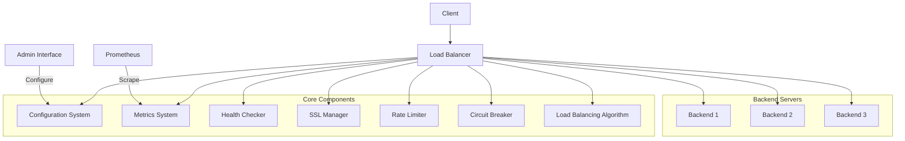

# HTTP Load Balancer

An HTTP load balancer implementation in Go with several features, including weighted round-robin, circuit breaker, rate limiting, and SSL/TLS support.

## Features

### Core Load Balancing

- Multiple backend support with configurable endpoints
- Multiple frontend port configuration
- Advanced load balancing algorithms:
  - Round-robin
  - Weighted round-robin with dynamic weight adjustment
- Health check system for backend monitoring
- Graceful operations (shutdown, restart, rollout, rollback)

### Security

- SSL/TLS support with:
  - Certificate management
  - Mutual TLS authentication
  - Certificate reloading
  - Custom certificate verification
- Rate limiting:
  - Token bucket algorithm
  - Sliding window algorithm
  - Configurable rates and bursts
- Circuit breaker pattern:
  - Failure threshold configuration
  - Half-open state handling
  - Automatic recovery

### Monitoring & Operations

- Prometheus metrics integration:
  - Request counts
  - Response times
  - Error rates
  - Backend health status
  - Circuit breaker states
  - Rate limiter statistics
- Structured JSON logging
- Dynamic configuration system
- Admin API for runtime configuration

## Architecture



## Getting Started

### Prerequisites

- Go 1.20 or higher
- Docker and Docker Compose (for running examples)
- Make (optional, for using Makefile commands)

### Installation

```bash
# Clone the repository
git clone https://github.com/yourusername/lb-project.git
cd lb-project

# Build the project
make build

# Run tests
make test

# Run with example configuration
make run
```

### Configuration

Configuration is managed through `config.yaml`:

```yaml
frontends:
  - port: 8080
  - port: 8443 # SSL/TLS port

backends:
  - url: "http://backend1:9001"
    weight: 5
  - url: "http://backend2:9002"
    weight: 3

healthcheck:
  interval: "10s"
  timeout: "2s"
  path: "/health"

ssl:
  certFile: "cert.pem"
  keyFile: "key.pem"
  caFile: "ca.pem" # For mutual TLS
  clientAuth: 4 # RequireAndVerifyClientCert

ratelimit:
  enabled: true
  rate: 100 # requests per second
  burst: 50 # burst size
  algorithm: "token_bucket" # or "sliding_window"

circuitbreaker:
  threshold: 5 # failures before opening
  timeout: "30s" # time before half-open
  maxHalfOpen: 3 # max requests in half-open state

logging:
  level: "info"
  format: "json"

metrics:
  enabled: true
  port: 9090
```

## Error Handling

The load balancer implements comprehensive error handling:

- Custom error types with context
- Detailed error tracking and reporting
- Error code categorization
- Automatic error recovery
- Error metrics collection

## Operational Features

### Rolling Updates

Support for zero-downtime updates:

```go
err := lb.Rollout(ctx, RolloutConfig{
    NewBackends: []string{"http://new1:9001", "http://new2:9002"},
    BatchSize:   1,
    Interval:    time.Second * 30,
})
```

### Graceful Shutdown

```go
ctx, cancel := context.WithTimeout(context.Background(), 30*time.Second)
defer cancel()
lb.Start(ctx)
```

### Rate Limiting

Two algorithms available:

1. Token Bucket - For steady rate limiting
2. Sliding Window - For precise rate control

### Circuit Breaker

Protects backends from cascading failures:

- Configurable failure thresholds
- Automatic recovery
- Half-open state for testing recovery

## API Documentation

### Admin API Endpoints

#### Health Check

```http
GET /health
```

#### Metrics

```http
GET /metrics
```

#### Backend Management

```http
GET /api/v1/backends           # List backends
POST /api/v1/backends         # Add backend
DELETE /api/v1/backends/{id}  # Remove backend
PUT /api/v1/backends/{id}     # Update backend
```

#### Configuration

```http
GET /api/v1/config           # Get current config
POST /api/v1/config         # Update config
```

## Development

### Running Tests

```bash
# Run all tests
make test

# Run specific test suites
make test-unit
make test-integration

# Run with race detection
make test-race

# Generate test coverage
make test-coverage
```

### Code Style

This project follows standard Go code style guidelines. Run:

```bash
# Format code
make fmt

# Run linter
make lint
```

## Contributing

1. Fork the repository
2. Create your feature branch (`git checkout -b feature/amazing-feature`)
3. Commit your changes (`git commit -m 'Add some amazing feature'`)
4. Push to the branch (`git push origin feature/amazing-feature`)
5. Open a Pull Request

## License

This project is licensed under the MIT License - see the [LICENSE](LICENSE) file for details.

## Roadmap

- [ ] Add support for WebSocket connections
- [ ] Implement service discovery integration
- [ ] Add support for dynamic backend scaling
- [ ] Implement request retries with backoff
- [ ] Add support for request tracing
- [ ] Implement cache layer
- [ ] Add support for configuration hot reload
- [ ] Implement advanced routing rules
